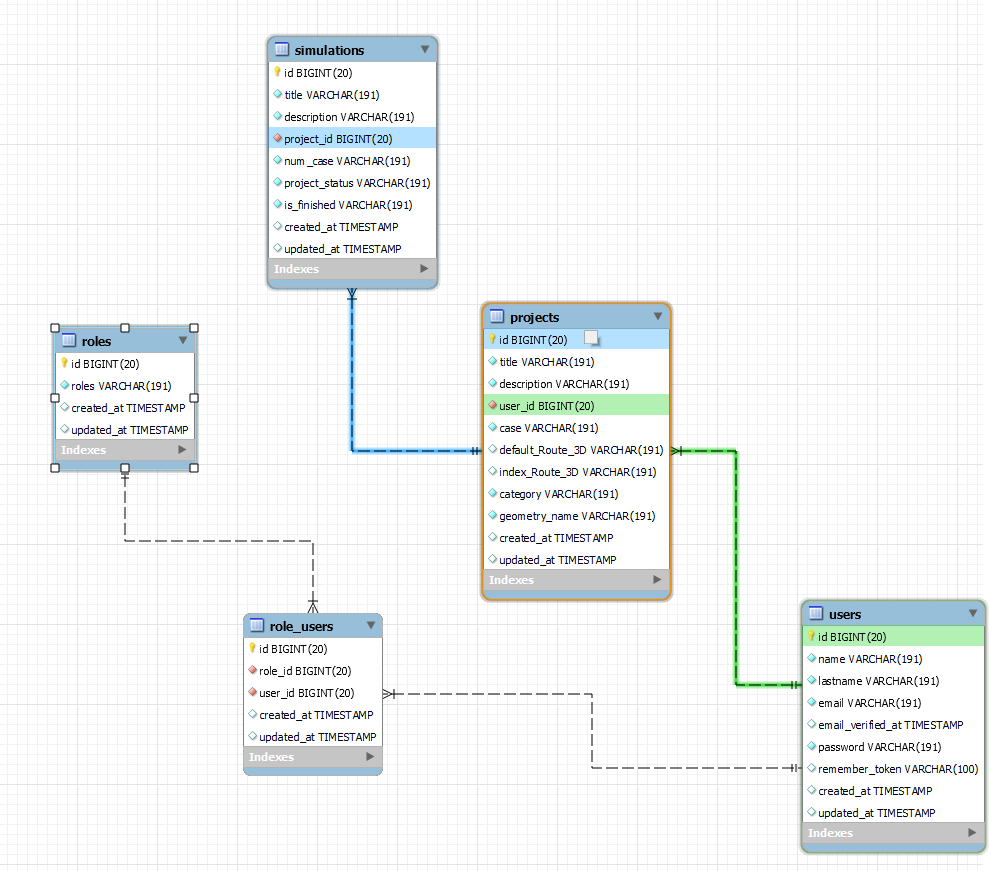

<p align="center"><a href="https://laravel.com" target="_blank"></a></p>


# Symula CFD - Backend


## 0. Indice:


  [1. Introduccion:](#1-introducción)<br>
  [2. Como Usar:](#3-descripción-del-proyecto)<br>
  [3. Herramientas Utilizadas:](#5herramientas-utilizadas)<br>


## 1. Introducción.

- El proyecto se basa en la creación de una app para una Startup que realiza simulaciones de CFD 
(Dinámica de Fluidos Computacional) por medio de un software propio, en el cual quiere ampliar su 
modelo de negocio proporcionando a empresas la posibilidad de contratar un servicio de simulación 
online, en el cual se les permitiría a los clientes subir sus modelos 3D, ajustar parámetros específicos 
y lanzar la simulación a los servidores de la Startup en cuestión.

- BackEnd and BBDD Deployed on [HEROKU](https://symula-cfd-backend.herokuapp.com)<br>
- Aquí una imagen del diseño de la Base de datos :
  
 

## 2. Como Usar.

- Esta es la parte del backend que se encarga de recibir los datos de los clientes y enviar los resultados, si se desea realizar una prueba puedes acuidir a este enlace:
  "[https://master.d15996taemuqlj.amplifyapp.com/](https://master.d15996taemuqlj.amplifyapp.com/)"
<br>
Este es el link para el frontend de la aplicacion que esta deployado en AWS


<br>
    
A continuacion se describen las posibilidades que tienes:

### EndPoints de Users :

Ejemplo: https://symula-cfd-backend.herokuapp.com/api/register

- Registro :
  
  ```bash
  Route::post('/register', [AuthController::class, 'register']);
  ```

- Login : 
  
  ```bash
  Route::post('/login', [AuthController::class, 'login']);
  ```

- Logout : 
  
  ```bash
  Route::post('/logout', [AuthController::class, 'logout']);
  ```

- Profile :
  
   ```bash
  Route::get('/me', [AuthController::class, 'me']);
  ```


<br>


### EndPoints de Projects :

Ejemplo: https://symula-cfd-backend.herokuapp.com/api/projects

- All Projects :
  
  ```bash
  Route::get('/projects', [ProjectController::class, 'index']);
  ```

- New Project :
  
  ```bash
  Route::post('/projects', [ProjectController::class, 'store']);;
  ```

- Get Project By User ID :
  
  ```bash
  Route::get('/projects/user/{user_id}', [ProjectController::class, 'indexByUser']);
  ```

- Get Porject By ID :
  
  ```bash
  Route::get('/projects/{id}', [ProjectController::class, 'show']);
  ```

- Update Project By ID :
  
  ```bash
  Route::put('/projects/{id}', [ProjectController::class, 'update']);
  ```

- Delete Project By ID :
  
  ```bash
  Route::delete('/projects/{id}', [ProjectController::class, 'destroy']);
  ```

- Update Project Specific Fields (MODEL 3D URLS) By ID :
  
  ```bash
  Route::delete('/projects/{id}', [ProjectController::class, 'destroy']);
  ```
<br>


## 3. Herramientas Utilizadas.

- MySQL Workbench - (BBDD)
- Visual Studio Code - (DEV)
- Postman - (DEBUG)
- Heroku - (DEPLOY)

<br>


[Subir](#top)